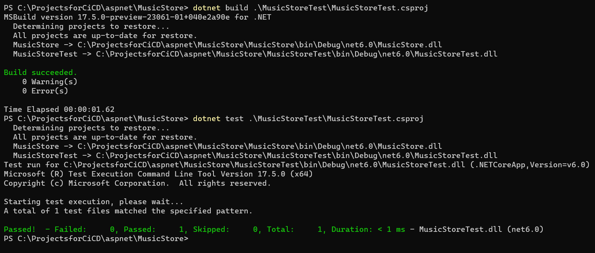
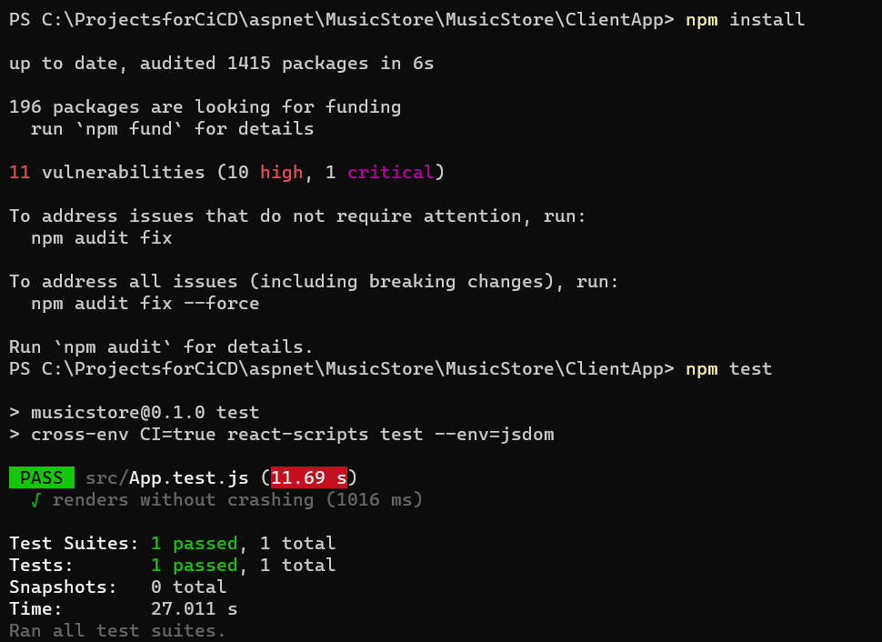

This is Sample Project Created for CI/CD
-----------------------------------------

* This project requires 
    * .net 6.0 core
    * nodejs 16
* The steps to build this project are
```
dotnet restore ./MusicStore/MusicStore.csproj
dotnet build ./MusicStore/MusicStore.csproj
 ```
 * The steps to run the unit tests are
```
dotnet restore ./MusicStore/MusicStore.csproj
dotnet build ./MusicStore/MusicStore.csproj

```
* Below screen shot is on windows system build

* To build the frontend

* To run the frontend
```
# Cd in to ClientApp Folder
npm install
npm run start
```
* To get the test results junit format is also supported
